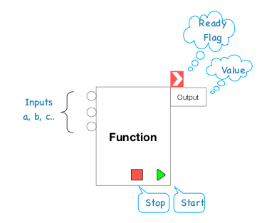

# 2.1 Language Elements

The fundamental parts used to construct other PAK parts.

Also known as _PAK Kernel Components_.

Components
----------

Are the building blocks of Parts and Kits.

A **component** has one or more **inputs** and one or more **outputs**.

### Inputs

### Outputs

When enough inputs values are available to perform its function, it produces its
outputs according to its intended logic and changes its status to "ready".

Simple Values
-------------

Every value in PAK is represented by a **string** of characters encoded as UTF-8
text.

The **null string** is a string with no (zero) characters.

### Numeric Values

Numbers are represented as strings and are used in mathematical operations.

The numeric value of a string is deduced by extracting decimal digits (0 to
9) from left to right until a non-decimal digit is encountered.

Numeric strings may be prefixed by "+" or "-" characters.

A decimal point "." may separate the fractionary part of a real number.

 
#### *Examples*:

| String        | Numeric Value |
|---------------|---------------|
| "1"           | 1             |
| "-3x4"        | \-3           |
| "007"         | 7             |
| "ABC"         | 0             |
| ""            | 0             |
| "2,023,000"   | ​2             |
| "2.500"       | 2.5           |
| "-0.25"       | \-.25         |
| "true"        | 0             |
| "-0"          | 0             |
| "+\-+\-\-55FF" | \-55         |
| "\$16.99"     | 0             |

### Canonical Representation of Numbers

The numeric value result of mathematical operations produced by any PAK component is always represented by its **canonical numeric** form:

- Excess zero digits are removed from the integer part (*"0070" becomes "70"*)
- Excess zero digits are removed from the fractionary part (*"6.500" becomes "6.5"; "2.000" becomes "2"*)
- The zero integer part is removed for real numbers less than 1 and greater than -1 (*"0.75" becomes ".75"*)
- Excess plus signs are removed (*"+384" becomes "384"*)
- Excess minus signs are reduced to a single sign or not, after each inversion (*"\-\-\-33" becomes "-33"; "\-\-22" becomes "22"*)

### Boolean Values

The boolean value is deduced from the numeric interpretation of a string:

-   "0" (zero) is **false**
-   everything else is **true**

Compound Values
---------------

A compound value is composed of an sequence of strings or compound values.

Each element may be referenced by its position, starting with **1**.

### Compound Metapak

For documentation purposes, a compound value may reference another compound
value which helps describe each element.

A Compound Metapak is composed of the **compound name** followed by the sequence
of each **element name**.

### Compound Examples

#### a1) Simple Compound:

country: [ "AF", "Afghanistan", "29121286", "647500", "AS" ]

#### a1.1) Simple Compound Metapak:

***country***
1.  *code*
2.  *name*
3.  *population*
4.  *area: (km2)*
5.  *continent*

#### a2) Two-level Compound Metapak:

countries: [
[ "AF", "Afghanistan", "29121286", "647500", "AS"],
[ "AL", "Albania", "2.986.952", "28.748", "EU"],
[ "DZ", "Algeria", "34.586.184", "2.381.740", "AF"],
[ "AD", "Andorra", "84.000", "468", "EU"],
[ "AQ", "Antarctica", "0", "14.000.000", "AN"],
[ "AG", "Antigua and Barbuda", "86.754", "443", "EU"],
[ "AR", "Argentina", "41.343.201", "2.766.890", "SA"],
[ "AM", "Armenia", "2.968.000", "29.800", "AS"],
[ "AW", "Aruba", "71.566", "193", "NA"],
[ "AU", "Australia", "21.515.754", "7.686.850", "OC"],
[ "AT", "Austria", "8.205.000", "83.858", "EU"]
]

#### a2.1) Two-level Compound Metapak:

***countries***
1.  [ ***countries**: country(1..400) ]

#### a) Compound Metapak:

***sale:***
1.  *merchandise*
2.  *detail:*
    1.  *size*
    2.  *color*
3.  *quantity*
4.  *price*

 

#### b) Compound Value with Metapak:

[ ***sale**: merchandise, detail, quantity, price* ]
1.  "T-Shirt"
2.  [ ***detail**: size, color*]
    1.  "GG"
    2.  "dark blue"
3.  "1"
4.  "14.95"

 

#### c) Another Compound Value with Metapak:

[ ***order**: orderNumber, table, timeOrdered, items, totalPrice, payment, employee* ]
1.  "92832642"
2.  "38"
3.  "2020-03-17 13:55"
4.  [ ***items**: item(1..20)*]
    1.  [ ***item**: qty, description, price, option* ]
        1.  "2"
        2.  "Veggie hamburger"
        3.  "23.98"
    2.  []
        1.  "1"
        2.  "Poke combo"
        3.  "14.99"
    3.  []
        1.  "3"
        2.  "Açaí booster"
        3.  "21.75"
        4.  "no alfafa"
5.  "60.72"
6.  "cash"
7.  "Mary Ann"

 

#### d) Contact Compound Metapak:

**contact**:
1.  name
2.  birthday
3.  gender: (M=male,F=female)
4.  addresses:
    1.  address:
        1.  type: (H=home,W=work,S=school,O=Other)
        2.  street
        3.  complement
        4.  city
        5.  state
        6.  postalCode
        7.  country
5.  phones(0..5):
    1.  phone:
        1.  countryCode
        2.  areaCode
        3.  number
        4.  type: (M=mobile,H=home,W=work,O=other)
        5.  remark

> *Next*: [2.2 Kernel Components](2.2-Kernel-Components.md)
