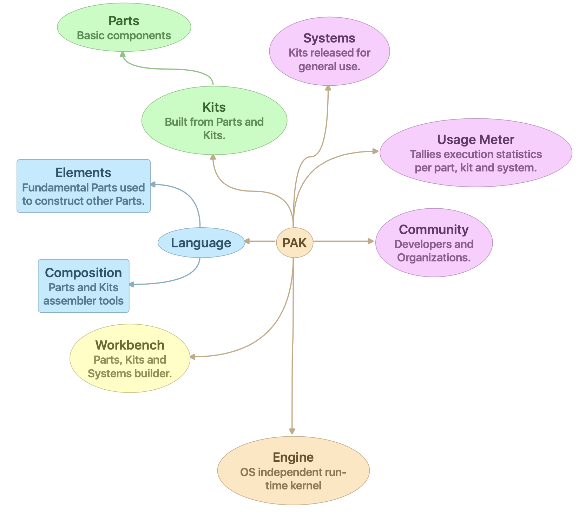

1 Introduction
==============
 

2 PAK Language
==============

 

2.1 Language Elements
---------------------

Fundamental Parts used to construct other Parts.

- [Components](2.1-language-elements)
- [Simple Values](2.1-language-elements)
  - [Numeric Values](2.1-language-elements)
  - [Canonical Representation of Numbers](2.1-language-elements)
  - [Boolean Values](2.1-language-elements)
- [Compound Values](2.1-language-elements)

2.2 Kernel Components
---------------------

Parts and Kits assembler tools.

- 2.2.1 [Arithmetic Components](2.2-kernel-components)
- 2.2.2 [String Components](2.2.2-String-Components.md)
- 2.2.3 [Compound Components](2.2.3-Compound-Components.md)
- 2.2.4 [User Interface Components](2.2.4-User-Interface-Components.md)

2.3 Composition
---------------

Parts and Kits assembler tools.

 

3 Kits
======

Built from Parts and Kits

 

3.1 Parts
---------

Basic components.

 

4 Systems (Programs)
====================

Kits released for general use.

 

4.1 Usage Meter
---------------

Tallies execution statistics per part, kit and system.

 

5 Community
===========

Developers and Organizations.

 

6 Workbench
===========

Parts, Kits and Systems builder.

 

6.1 Developing Process
----------------------

 

6.2 Test Process and Tools
--------------------------

 

6.3 Deploy Process and Tools
----------------------------

 

7 Engine
========

OS independent run-time kernel.
